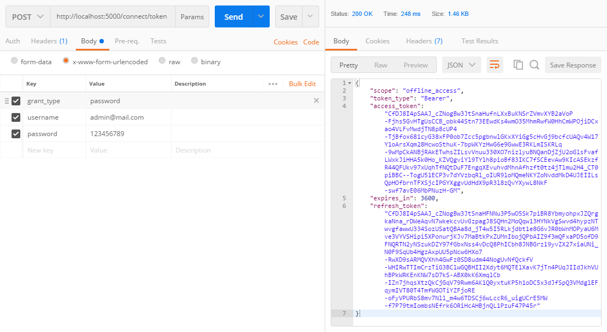
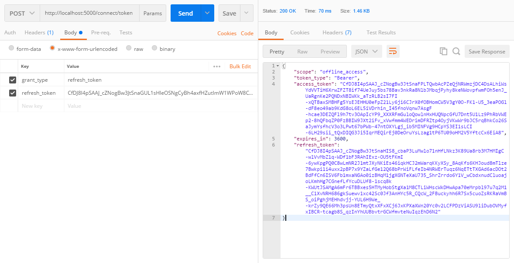
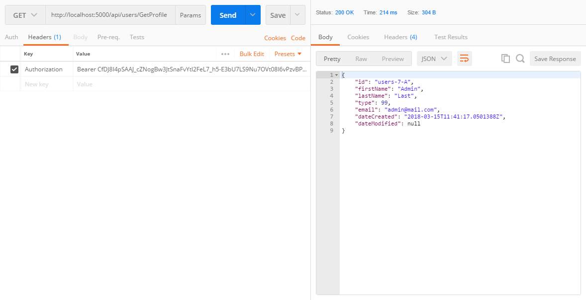

# .NET core WebApi project and RavenDB

## Required

* [.NET Core 2.1.4 SDK](https://www.microsoft.com/net/download/thank-you/dotnet-sdk-2.1.4-windows-x64-installer)
* [RavenDB 4.0](https://ravendb.net/)

## Setup

1.  Clone
1.  Go to `Startup.cs` file and replace:
    * `{path_to_your_client_certificate_pfx_file}` with own certificate file path
    * `{database_name}` with own database name
    * `{database_url}` with own database url
1.  `dotnet restore` (optional)
1.  `dotnet build` (optional)
1.  `dotnet run`

## Additional information

* Dependency injection (DI)
  * [Dependency injection into controllers](https://docs.microsoft.com/en-us/aspnet/core/mvc/controllers/dependency-injection)
  * [Multi-tenant Dependency Injection in ASP.NET Core](http://benfoster.io/blog/asp-net-core-dependency-injection-multi-tenant)
* Routing
  * [Routing to Controller Actions](https://docs.microsoft.com/en-us/aspnet/core/mvc/controllers/routing)
  * [Routing in ASP.NET Core](https://docs.microsoft.com/en-us/aspnet/core/fundamentals/routing)
* [Format response data](https://docs.microsoft.com/en-us/aspnet/core/mvc/models/formatting)
* [Handling Model State Errors (ModelState.IsValid)](https://docs.microsoft.com/en-us/aspnet/core/mvc/models/validation#handling-model-state-errors)
* [Cross Origin Resource Sharing (CORS)](https://docs.microsoft.com/en-us/aspnet/core/security/cors)
* [ASP.NET Core Middleware](https://docs.microsoft.com/en-us/aspnet/core/fundamentals/middleware/index?tabs=aspnetcore2x)
* RavenDB
  * [How to Create a Document Store](https://ravendb.net/docs/article-page/4.0/csharp/client-api/creating-document-store)
  * [Setting up Authentication and Authorization](https://ravendb.net/docs/article-page/4.0/csharp/client-api/setting-up-authentication-and-authorization)
* [Fluent Validation](https://github.com/JeremySkinner/FluentValidation)
* Identity
  * [AspNet.Security.OpenIdConnect.Server (ASOS)](https://github.com/aspnet-contrib/AspNet.Security.OpenIdConnect.Server)
  * [**Creating your own OpenID Connect server with ASOS**](http://kevinchalet.com/2016/07/13/creating-your-own-openid-connect-server-with-asos-introduction/)
  * [Password Hashing](https://docs.microsoft.com/en-us/aspnet/core/security/data-protection/consumer-apis/password-hashing)
  * [BCrypt.Net-Core](https://github.com/neoKushan/BCrypt.Net-Core)

## TODO

* [Create useful .gitignore files for your project](https://www.gitignore.io/)
* [Enforcing HTTPS in an ASP.NET Core app](https://docs.microsoft.com/en-us/aspnet/core/security/enforcing-ssl)
* [Sorting, Filtering, and Paging with the Entity Framework in an ASP.NET MVC Application](https://docs.microsoft.com/en-us/aspnet/mvc/overview/getting-started/getting-started-with-ef-using-mvc/sorting-filtering-and-paging-with-the-entity-framework-in-an-asp-net-mvc-application)
* Caching
  * [In-memory caching in ASP.NET Core](https://docs.microsoft.com/en-us/aspnet/core/performance/caching/memory)
  * [Working with a distributed cache in ASP.NET Core](https://docs.microsoft.com/en-us/aspnet/core/performance/caching/distributed)
* [Logging in ASP.NET Core](https://docs.microsoft.com/en-us/aspnet/core/fundamentals/logging/?tabs=aspnetcore2x)
* [Account confirmation and password recovery in ASP.NET Core](https://docs.microsoft.com/en-us/aspnet/core/security/authentication/accconfirm?tabs=aspnetcore2x)
* [Safe storage of app secrets during development in ASP.NET Core](https://docs.microsoft.com/en-us/aspnet/core/security/app-secrets?tabs=visual-studio)

---

## Testing authorization server with [Postman](https://www.getpostman.com/)

* Retrieving an `access_token` using the `Resource Owner Password Credentials (ROPC)`

* Retrieving an `access_token` using the `refresh_token`

* Making an `API` request using the `access_token`

